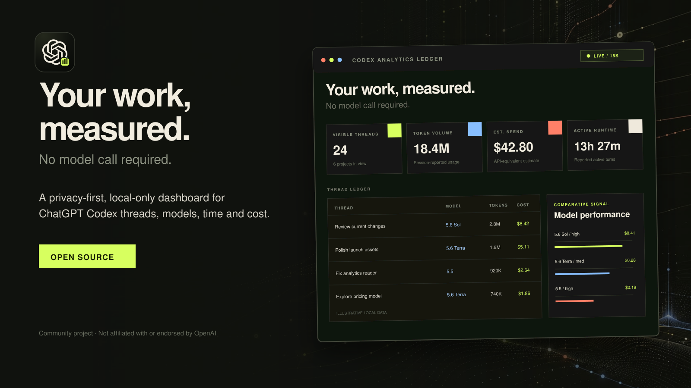

<picture>
  <source media="(prefers-color-scheme: dark)" srcset="./public/brand/codex-analytics-wordmark-dark.png" />
  <source media="(prefers-color-scheme: light)" srcset="./public/brand/codex-analytics-wordmark-light.png" />
  
</picture>

Codex Analytics Ledger is a privacy-first, local-only dashboard for understanding
how you use Codex: threads, models, runtime, token usage, API-equivalent cost
estimates, and task-level details.

**See where your Codex time, tokens, and money go—without sending your work
anywhere.** Compare models, inspect individual tasks, understand active runtime,
and estimate API-equivalent costs from one focused local dashboard.

It reads Codex state on the same machine and does not call an AI model, upload
Codex content, or send prompts to an analytics service. The included scripts also
disable Next.js telemetry and bind the server to `127.0.0.1`.

> [!IMPORTANT]
> This project is designed for local use. Do not expose it to a LAN or the
> internet without authentication and an explicit data-redaction layer.



> [!TIP]
> **Star this repository if you find Codex Analytics Ledger useful.** It helps
> more Codex users discover the project and supports continued development.

## Project status

Codex Analytics Ledger is pre-1.0 software. It reads internal Codex SQLite and
JSONL formats that may change between Codex releases. A Codex update can require
a corresponding reader update even when this repository has not changed.

The current release has no automated test suite. TypeScript, ESLint, and a
production build are used as the required verification baseline.

## What it shows

- Threads across local Codex projects
- Model and reasoning effort per thread and task
- Last-updated time, active duration, and wall-clock duration
- Input, cached-input, output, reasoning-output, and total tokens
- API-equivalent cost estimates using editable browser-local pricing
- Per-task user input, model, runtime, tokens, and estimated cost
- Prompt, tool, shell, and web-call counts
- Flat or collapsible project-grouped views
- Recent, cost, token, and runtime sorting
- Light and dark themes with a saved Grouped/Isolated preference
- Model-performance aggregates

Internal approval and subagent threads are hidden by default. Use the **Workers**
toggle to include them.

## Requirements

- Node.js 24 or newer
- A local Codex installation with a readable `CODEX_HOME` directory
- Windows, macOS, or Linux

Node.js 24 or newer is required because the reader uses the built-in
`node:sqlite` module and its read-only database mode. Use a current Node.js 24
release to receive the latest SQLite fixes and stability improvements.

## Quick start

Clone or download the repository, then run it from the project directory.

### Windows PowerShell

```powershell
npm.cmd ci
npm.cmd run dev
```

### macOS/Linux

```bash
npm ci
npm run dev
```

Open <http://localhost:3000>.

For a production-style local run:

```bash
npm run build
npm run start
```

The development and production scripts explicitly bind to `127.0.0.1`, so the
server accepts connections only from the same machine. They also set
`NEXT_TELEMETRY_DISABLED=1`. Running Next.js directly instead of using the
included scripts may use Next.js defaults.

## Configure Codex state

`CODEX_HOME` defaults to:

- Windows: `%USERPROFILE%\.codex`
- macOS/Linux: `~/.codex`

No configuration is normally necessary. To use a non-standard location, either
set variables in the current shell or copy `.env.example` to `.env.local` and
edit the copied file. Never commit `.env.local`.

Codex Analytics Ledger checks SQLite locations in this order, matching Codex's
documented precedence:

1. `sqlite_home` in `CODEX_HOME/config.toml`
2. `CODEX_SQLITE_HOME`, when set
3. `CODEX_HOME`
4. `CODEX_HOME/sqlite`

Relative `sqlite_home` values resolve from the directory where the app starts.
The newest `state_*.sqlite` candidate is opened read-only. Referenced session
JSONL files are parsed for turn-level usage.

### Windows PowerShell

```powershell
$env:CODEX_HOME = "D:\path\to\your\codex-home"
$env:CODEX_SQLITE_HOME = "D:\path\to\sqlite-folder"
npm.cmd run dev
```

### macOS/Linux

```bash
export CODEX_HOME="$HOME/.codex"
export CODEX_SQLITE_HOME="/path/to/sqlite-folder"
npm run dev
```

You normally need only `CODEX_HOME`. If `config.toml` defines `sqlite_home`, that
value takes precedence over `CODEX_SQLITE_HOME`.

## Privacy and security model

Codex Analytics Ledger is intentionally local-first:

- SQLite is opened with `readOnly: true`.
- The app does not write to Codex state or session files.
- Standard scripts listen only on `127.0.0.1`.
- Standard scripts disable anonymous Next.js telemetry.
- There are no application analytics SDKs, hosted databases, model calls, or API
  keys.
- Assistant responses, reasoning text, tool arguments, and tool outputs are not
  returned by the analytics API.
- Pricing overrides, theme, and display preferences stay in browser
  `localStorage`.

The local analytics API and browser do receive sensitive local metadata needed
to render the dashboard:

- Raw user prompts and thread titles
- Thread identifiers and timestamps
- Project names and absolute project paths
- The resolved `CODEX_HOME` and SQLite database path
- Models, reasoning effort, token usage, and timing metrics

Treat the dashboard like any other sensitive developer tool. Do not paste real
session files into issues or pull requests. Never commit `.codex/`, SQLite files,
JSONL transcripts, `.env` files, `.next/`, or `node_modules/`.

See [SECURITY.md](./SECURITY.md) for vulnerability reporting and the complete
security boundary.

## Cost estimates

```text
uncached input × input rate
+ cached input × cache-read rate
+ output × output rate
```

Rates are USD per one million tokens. The default catalog follows current OpenAI
API list prices for the supported models. Prompts exceeding 272K recorded input
tokens use the documented 2× input and 1.5× output long-context multipliers when
the model has long-context rates.

These values are **API-equivalent estimates**, not a reconstruction of a user's
ChatGPT or Codex subscription bill. ChatGPT plans use plan limits and credits;
API-key authentication is billed from API usage. Exact API billing may also
differ because local Codex events do not expose every billing dimension,
especially cache-write token counts and tool-specific charges.

Pricing references:

- [OpenAI model catalog](https://developers.openai.com/api/docs/models)
- [GPT-5.6 Terra pricing and long-context rules](https://developers.openai.com/api/docs/models/gpt-5.6-terra)
- [GPT-5.5 pricing](https://developers.openai.com/api/docs/models/gpt-5.5)
- [GPT-5.4 pricing](https://developers.openai.com/api/docs/models/gpt-5.4)
- [Codex plan and credit pricing](https://learn.chatgpt.com/docs/pricing)

Open **Pricing** in the dashboard to review or edit rates. Changes stay in the
current browser and are never uploaded.

## Compatibility

The project intentionally avoids modifying Codex data, but its reader depends on
internal state details including SQLite table columns, JSONL event names, and
rollout paths. These are not treated as a stable public integration contract.

When reporting a compatibility problem, include:

- Operating system and version
- Node.js version from `node --version`
- Codex version
- The sanitized error message

Do not attach databases, transcripts, prompts, authentication files, usernames,
or absolute machine paths.

## Troubleshooting

### “No Codex state database was found”

Confirm that Codex has completed at least one task, then inspect the expected
directory:

```powershell
Get-ChildItem "$HOME\.codex" -Recurse -Filter "state_*.sqlite"
```

If the database is elsewhere, configure `CODEX_HOME`, `CODEX_SQLITE_HOME`, or
`sqlite_home`, then restart the app.

### New threads are not visible yet

Click **Refresh**. The dashboard also refreshes every 15 seconds while the tab is
visible and automatic refresh is enabled.

### Some fields are unavailable

Older sessions or future event formats may not contain the detailed events the
reader understands. The dashboard keeps the thread and reports only supported
fields.

### Port 3000 is already in use

Forward a different port to Next.js while preserving the loopback binding:

```bash
npm run dev -- --port 3001
```

Then open <http://localhost:3001>.

## Project structure

```text
src/app/api/analytics/route.ts        Local read-only analytics endpoint
src/lib/codex-reader.ts               Codex SQLite and JSONL reader
src/lib/analytics-types.ts            Runtime validation and shared types
src/lib/pricing.ts                    API-equivalent cost estimation
src/components/dashboard/             Dashboard UI and detail views
.github/                               Issue and pull-request templates
SECURITY.md                            Security policy and reporting
CONTRIBUTING.md                        Contribution workflow
CHANGELOG.md                           User-facing release history
```

## Verification

```bash
npx tsc --noEmit
npx eslint . --fix
npm run build
```

The project does not yet have automated unit or integration tests. Do not treat a
successful build as proof that every Codex state version is compatible.

## Roadmap

- Codex quota percentage and reset windows using Codex app-server rate limits
- A VS Code status-bar extension with a detailed analytics panel
- Fixtures and automated compatibility tests for supported Codex state formats

Roadmap items are plans, not current functionality.

## Give this repository to an AI agent

Copy the prompt below after cloning the repository:

```text
You are setting up Codex Analytics Ledger, a local-only Next.js analytics dashboard.

1. Inspect README.md, AGENTS.md, and the existing source before changing code.
2. Install dependencies with `npm ci` (use `npm.cmd` on Windows when needed).
3. Confirm Node.js is version 24 or newer.
4. Keep all analytics local. Never upload prompts, transcripts, project names,
   SQLite files, authentication data, environment variables, or machine paths.
5. Do not modify Codex state. The reader must remain read-only.
6. Use the default Codex location unless I provide a different CODEX_HOME or
   CODEX_SQLITE_HOME value. Set overrides only in the current shell or .env.local.
7. Start the app with `npm run dev` and open http://localhost:3000.
8. Do not remove the 127.0.0.1 binding or expose the app remotely.
9. Run `npx tsc --noEmit`, `npx eslint . --fix`, and `npm run build` after changes.
10. Never commit .env files, .codex data, databases, JSONL sessions, build output,
    or user-specific paths.
```

## Contributing

Read [CONTRIBUTING.md](./CONTRIBUTING.md) before opening a pull request. By
participating, you agree to follow [CODE_OF_CONDUCT.md](./CODE_OF_CONDUCT.md).

## Brand and launch assets

The repository includes the canonical application icon, multi-resolution
favicon exports, light and dark wordmarks, GitHub social-preview artwork, and
wide and square launch images. See the [complete brand guidelines](./public/brand/BRAND.md)
for construction, clear space, minimum sizes, colors, typography, correct usage,
and attribution guidance.

Codex Analytics Ledger is an independent community project and is not affiliated
with or endorsed by OpenAI. The OpenAI symbol belongs to OpenAI.

## Security

Do not report vulnerabilities containing sensitive local data in public issues.
Follow [SECURITY.md](./SECURITY.md).

## License

Codex Analytics Ledger is available under the permissive [MIT License](./LICENSE).
